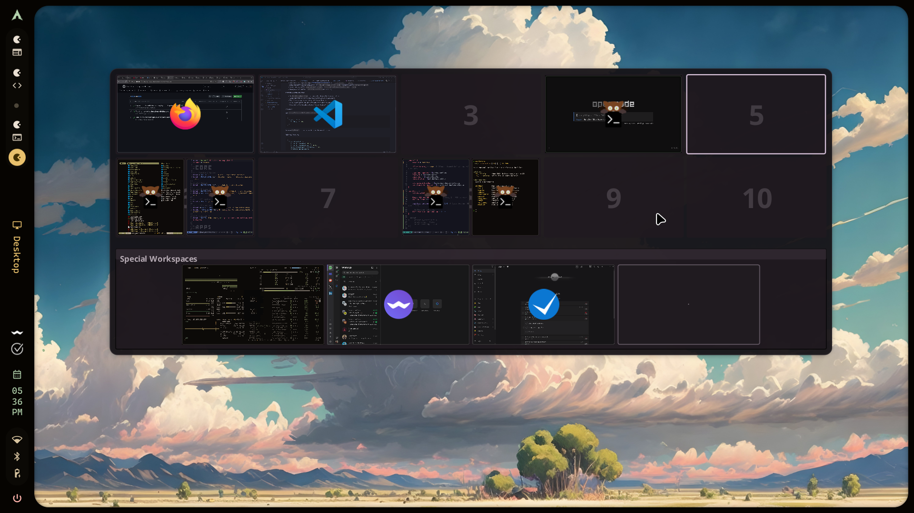

# Overzicht

Standalone Quickshell workspace overview for Hyprland.

## Overview

Overzicht shows a full-screen grid of your workspaces with live window previews.
It is controlled over Quickshell IPC and is designed for keyboard-first workflow.

- Toggle: `overzicht ipc call overview toggle`
- Open: `overzicht ipc call overview open`
- Close: `overzicht ipc call overview close`

`WlrLayershell.namespace` is `overzicht`.

## Preview

<https://github.com/user-attachments/assets/9c3d2488-1c24-4cdd-84cd-87c4397d02a8>

## Support Policy

Nix is the only supported installation path.

- No AUR package.
- No manual non-Nix installer.

## Removed Features

Compared to the quickshell-overview project, the following functionality was removed:

- Matugen-driven dynamic color loading
  (`useMatugenColors` and `Appearance.colors.qml` template flow).

## Flake Outputs

- `packages.<system>.overzicht`
- `packages.<system>.default`
- `overlays.default`
- `homeModules.default`
- `nixosModules.default`

## Home Manager Module

Option namespace: `programs.overzicht`.

- `enable`
- `systemd.enable`
- `package`
- `settings`
- `colors`

Runtime files generated by the module:

- `~/.config/overzicht/settings.json`
- `~/.config/overzicht/colors.json`
- Complete examples: [`EXAMPLE.md`](EXAMPLE.md)

`settings.json` controls layout and behavior.
`colors.json` controls the full `m3*` palette used in `common/Appearance.qml`.

Optional setting: `overview.hideEmptyRows` (default `false`) hides workspace
rows in the active group that contain no windows, while keeping the current
workspace row visible.

Additional optional settings:

- `overview.useWorkspaceMap`
- `overview.workspaceMap`
- `overview.orderRightLeft`
- `overview.orderBottomUp`
- `overview.previewsEnabled`
- `overview.previewMode`
- `overview.includeInactiveMonitorPreviews`
- `overview.previewRecaptureDelayMs`
- `hacks.hyprlandEventDebounceMs`

For full JSON examples of both runtime files, see [`EXAMPLE.md`](EXAMPLE.md).

## NixOS Module

Option namespace: `services.overzicht`.

- `enable`
- `package`
- `target`
