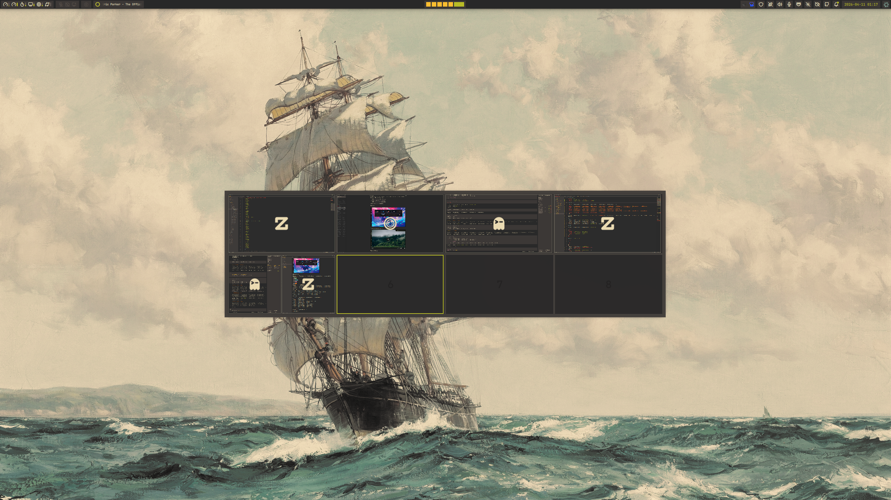

<div align="center">
  # Overzicht

  Standalone Quickshell workspace overview for Hyprland with live window previews, drag-and-drop moves, and Nix-first integration.

  [](https://nixos.wiki/wiki/Flakes)
  [](https://hypr.land)
  [](https://quickshell.outfoxxed.me/)
  [](https://www.qt.io/)
  [](https://kernel.org)
  [](https://github.com/adam01110/overzicht)

  [Overview](#overview) - [Features](#features) - [Removed From Upstream](#removed-from-upstream) - [Installation](#installation) - [Configuration](#configuration) - [Development](#development) - [Notes](#notes)
</div>

Overzicht is a full-screen workspace switcher built as a standalone Quickshell package. It renders the current workspace group as a grid, shows live or event-driven window previews, and talks to Hyprland directly for focus, workspace switching, and window moves.

<div align="center">
  
</div>

## Overview

- Standalone package entrypoint through `overzicht`, wrapping `quickshell -p ...`.
- Full-screen overlay on every screen using `WlrLayershell.layer = Overlay` and namespace `overzicht`.
- Keyboard-first control flow with IPC actions for opening, closing, and toggling the overview.
- Nix flake outputs for package, overlay, Home Manager module, and NixOS module.
- Runtime configuration loaded from JSON files under `~/.config/overzicht/`.

## Features

- Live workspace grid with scaled window previews sourced from Quickshell screencopy.
- Click a workspace tile to switch to it.
- Click a window preview to focus it.
- Middle-click a window preview to close it.
- Drag a window preview onto another workspace tile to move it there.
- Keyboard navigation with arrow keys or `h/j/k/l`.
- Optional reversed row and column ordering.
- Optional per-monitor workspace offsets through `workspaceMap`.
- Optional empty-row hiding within the active workspace group.
- Optional backdrop and wallpaper-backed empty workspaces.
- Event-driven preview refresh mode for lower capture churn.

## Removed From Upstream

Compared to upstream `quickshell-overview`, this fork intentionally removes:

- Matugen-driven dynamic color generation and the `Appearance.colors.qml` template flow.
- Caelestia color-source selection and live theme refresh.
- Configurable rounding options; overview surfaces are square-only here.
- Glass-mode styling and its related tint, border, and shine settings.

## Installation

Nix is the only supported installation path.

### Flake package

Run directly from a flake input or this repository:

```bash
nix run github:adam01110/overzicht
```

Build the package:

```bash
nix build .#overzicht
```

Available flake outputs:

- `packages.<system>.overzicht`
- `packages.<system>.default`
- `overlays.default`
- `homeModules.default`
- `nixosModules.default`

### Home Manager

Import the module and enable `programs.overzicht`:

```nix
{
  imports = [inputs.overzicht.homeModules.default];

  programs.overzicht = {
    enable = true;
    systemd.enable = true;

    settings = {
      overview.rows = 2;
      overview.columns = 4;
    };

    colors = {
      primary = "#fb4934";
      secondary = "#b8bb26";
      background = "#3c3836";
    };
  };
}
```

### NixOS module

Import the module and enable `services.overzicht`:

```nix
{
  imports = [inputs.overzicht.nixosModules.default];

  services.overzicht.enable = true;
}
```

## Usage

IPC target: `overview`

```bash
# Toggle the overview
overzicht ipc call overview toggle

# Open the overview
overzicht ipc call overview open

# Close the overview
overzicht ipc call overview close
```

Keyboard controls while the overview is open:

- `Left` / `Right` / `Up` / `Down` move across the visible grid.
- `h` / `j` / `k` / `l` mirror directional movement.
- `1` to `9` jump to the matching workspace position in the current group.
- `0` jumps to position 10 when the grid has at least ten cells.
- `Return` and `Escape` close the overlay.

## Configuration

Overzicht reads two runtime files:

- `~/.config/overzicht/settings.json`
- `~/.config/overzicht/colors.json`

The Home Manager module can generate both files for you. Complete examples and the full option reference live in [`EXAMPLE.md`](./EXAMPLE.md).

### `settings.json`

`settings.json` controls layout, motion, previews, and runtime behavior.

Main groups:

- `appearance`
- `overview`
- `windowPreview`
- `hacks`

> [!TIP]
> `previewMode` accepts `live` and event-driven values such as `event` or `snapshot`. For the full schema and examples, use [`EXAMPLE.md`](./EXAMPLE.md).

### `colors.json`

`colors.json` provides the palette consumed by `common/Appearance.qml`. Define your gruvbox or custom palette there, and use [`EXAMPLE.md`](./EXAMPLE.md) for the full key list.

## Development

```bash
# Inspect outputs
nix flake show

# Enter the dev shell
nix develop

# Format the repository
nix fmt

# Build the package
nix build .#overzicht
```

Formatting is configured through `treefmt`.

## Notes

- `WlrLayershell.namespace` is `overzicht`.
- The package is designed for Hyprland and depends on Quickshell Hyprland integration.
- There is no manual non-Nix installer and no AUR package.
